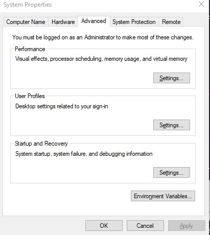

## Machine Learning with  Python and  Spark

Machine learning is the science of creating algorithms capable of learning based on the data provided to them.  The  primary techniques  used in machine learning that we will cover here: 

<div class="alert alert-block alert-info" style="margin-top: 20px">
    <ol>
        <li><a href="#ref1">Linear Regression</a></li>
        <li><a href="#ref2">Logistic Regression</a></li>
        <li><a href="#ref3">Classification </a></li>
        <li><a href="#ref4">Clustering  </a></li>
        <li><a href="#ref5">Collaborative filtering   </a></li>
    </ol>
</div>


In the following sections, I  will  take a high-level look at each of these techniques. 

## Installation of Spark in Windows.

 I will consider windows with a single computer that will simulate a cluster. In this way we test our spark codes and practice.

Go to your terminal and go to you root directory and create a directory called winutills

```
mkdir winutils
cd winutils
mkdir bin
cd bin
```

then we download winutils.exed

```
curl -OL https://github.com/ruslanmv/Machine-Learning-with-Python-and-Spark/raw/master/winutils.exe
```

then we create a empty folder

```
\tmp\hive
```

and then

```
c:\winutils\bin>winutils.exe chmod 777 \tmp\hive
```

Download Java [here](https://www.oracle.com/java/technologies/downloads/) and during the installation choose the directory C:\jdk

`C:\jdk`

Download  Apache Spark [here](https://spark.apache.org/downloads.html) . This tutorial was done by using Apache Spark 3.0.2 then

 install in the following path

`c:\Spark\spark-3.0.2-bin-hadoop2.7`


then we go to to the main menu and  **Edit the system environment variables**





and click **Environment Variables** and create new variables

`SPARK_HOME`

`C:\Spark\spark-3.0.2-bin-hadoop2.7`

and

`JAVA_HOME`

`C:\jdk-15`

and

`HADOOP_HOME`

`C:\hadoop\bin`


We modify **Path**  and we add

`%SPARK_HOME%\bin`

`%JAVA_HOME%\bin`


### Troubleshooting

To avoid  problems of memory in java such as 

PySpark: java.lang.OutofMemoryError: Java heap space


```bash
sudo vim $SPARK_HOME/conf/spark-defaults.conf
#uncomment the spark.driver.memory and change it according to your use. I changed it to below
spark.driver.memory 15g
# press : and then wq! to exit vim editor
```


If you use Spark 3.1 you should use

```
set PYSPARK_PYTHON=C:\Python27\bin\python.exe
```

### Testing our setup

Let us go to the  Anaconda Prompt (Anaconda3) by using cmd and we type

```
cd c:\Spark\spark-3.0.2-bin-hadoop2.7
```

we type

```
pyspark
```

we got

```
Welcome to
      ____              __
     / __/__  ___ _____/ /__
    _\ \/ _ \/ _ `/ __/  '_/
   /__ / .__/\_,_/_/ /_/\_\   version 3.0.2
      /_/

Using Python version 3.8.8 (default, Apr 13 2021 15:08:03)
SparkSession available as 'spark'.
>>>
```

type the following

```
>>> rdd=sc.textFile("README.md")
>>> rdd.count()
108
>>> quit
```


Great, you have installed Spark.

## Installing the Jupyter Notebook.

```
conda create -n pyspark   python==3.7 findspark
```


```
conda activate pyspark
```

then in your terminal type the following commands:

```
conda install ipykernel
```


```
python -m ipykernel install --user --name pyspark --display-name "Python (Pyspark)"
```


Installing libraries

```
pip install -U scikit-learn
```


```
pip install numpy matplotlib pandas
```

then open the Jupyter notebook with the command

```
jupyter notebook
```

Then we can create a new notebook, and later we select the **kernel Python (Pyspark)** and then we can start.


## Introduction to Machine Learning

Machine learning is the science of creating algorithms capable of learning based on the data provided to them.  The  primary techniques  used in machine learning that we will cover here: 


<div class="alert alert-block alert-info" style="margin-top: 20px">
    <ol>
        <li><a href="#ref1">Linear Regression</a></li>
        <li><a href="#ref2">Logistic Regression</a></li>
        <li><a href="#ref3">Classification </a></li>
        <li><a href="#ref4">Clustering  </a></li>
        <li><a href="#ref4">Collaborative filtering   </a></li>
    </ol>
</div>

In machine learning models we deal with data organized in tables that are stored in one database or in files.

The tables can be managed in Python with **Dataframes**.  **Dataframes** and **Datasets** are the the  **Applications Programming Interfaces** (API) that allows interact with the data.

Among the essential components of the Machine Learning models are:

- **Features**: Are the columns of the tables that we will use to create our Machine Learning Model, denoted by the vector

  of all the feature values of the ith instance in the dataset, or in other words, the predicted value of the ith row $$\vec x^{(i)}$$

- **Prediction values**: Is the  variable that we want to predict, denoted by $$\hat^{(i)} y=h(\vec  x^{(i)})$$   

- **Number of features**: Is the number of columns that we will use to create our Machine Learning Model

- **Weights**: Are simple the parameters of the Machine Learning Model.  

- **Hyperparameters**: Are additional parameters that Machine Learning is build on.


Those are the main ingredients of the most common Machine Learning Models. In the following sections, I  will  take a high-level look at each of these techniques.


<h2 id="ref1">Linear Regression</h2>

Linear models make a prediction using a linear function of input features.
$$
\hat y= w_0  + w_1 x_1 + w_2 x_2 + ... + w_n + x_n  = \vec w \cdot \vec x = h_w(\vec x)
$$


where $$\hat y$$ is the predicted value,  $$n$$  is the number of features, $$x_i$$ is the ith feature value and $$w_j$$ is the jth model parameter, where w_0 is called the bias term.


To train a Linear regression model , we need to find the value $$\vec w $$ that **minimizes the Root Mean Square Error** (RMSE)
$$
RMSE(\vec x,h)=\sqrt{\frac{1}{m}\sum_{i=1}^m(h(\vec x^{(i)})-y^{(i)})^2}
$$
In practical linear regression problems ,  we can use the **Mean Square Error**(MSE). The MSE of a Linear Regression hypothesis $$h_w$$ on a training set $$\vec x$$ is calculated by using the MSE **cost function** for Linear regression
$$
MSE(\vec x,h)=\frac{1}{m}\sum_{i=1}^m(\vec w^T \vec x^{(i)})-y^{(i)})^2
$$
In Machine Learning, vectors are often represented as column vectors, which are 2D arrays with a single column.


If  $$\vec w$$ and $$\vec x$$ are column vectors then the prediction is $$ \hat y = \vec w ^T \vec x $$, where $$ \vec w ^ $$ is the transpose of $$ w$$ that means a row vector instead a column vector.

To find the value of $$w$$ that minimizes the cost function we use the **Normal Equation**


$$
\hat \theta = (\vec x^T \vec x)^{-1} \vec x^T \vec y
$$
where $$ \theta w$$ is the value of  $$ \vec w$$ that minimizes the cost function, and $$\vec y$$ is the vector of target values.


There are different techniques that allows us minimizes the cost function.  Among them the most used is the  **Gradient descent**

We need to calculate how much the cost function will change if yuou change w_j a little bit.. This is possible with the partial derivative
$$
\frac{\partial }{\partial w_j}MSE(\vec w)=\frac{2}{m}\sum_{i=1}^m(\vec w^T \vec x^{(i)})-y^{(i)})x_j^{(i)}
$$
Instead use the partials individually we can compute the gradient vector
$$
\grad_W MSE(W)\frac{2}{m}X^T(XW-y)
$$
then we can use the gradient step
$$
W^{(step+1)}=W-\eta \grad_W MSE(W)\
$$


where eta $$\eta $$ is the hyperparameter called learning rate. 


<h2 id="ref2">Logistic Regression</h2>


 Linear Regression is suited for estimating continuous values (e.g. estimating house price), it is not the best tool for predicting the class of an observed data point.  In order to estimate the class of a data point, we need some sort of guidance on what would be the <b>most probable class</b> for that data point. For this, we use <b>Logistic Regression</b>.

As you know, <b>Linear regression</b> finds a function that relates a continuous dependent variable, <b>y</b>, to some predictors (independent variables x_1, x_2, etc.). For example, Simple linear regression assumes a function of the form:

$$
y = w_0 + w_1  x_1 + w_2  x_2 + \cdots
$$
and finds the values of parameters  $w_0, ws_1, w_2$, etc,$ where the term $w_0$ is the "intercept". It can be generally shown as:

$$
ℎ_w(𝑥) = w^TX
$$
Logistic Regression is a variation of Linear Regression, useful when the observed dependent variable, <b>y</b>, is categorical. It produces a formula that predicts the probability of the class label as a function of the independent variables.

Logistic regression fits a special s-shaped curve by taking the linear regression and transforming the numeric estimate into a probability with the following function, which is called sigmoid function 𝜎:

$$
ℎ_\vec w(\vec 𝑥) = \sigma({\vec w^T \vec X}) =  \frac {e^{(w_0 + w_1  x_1 + w_2  x_2 +...)}}{1 + e^{(w_0 + w_1  x_1 + w_2  x_2 +\cdots)}}
$$
Or ProbabilityOfaClass_1:
$$
P(Y=1|X) = \sigma({w^TX}) = \frac{e^{w^TX}}{1+e^{w^TX}}
$$


Where the logistic is a a sigmoid function that outputs a number between 0 and 1
$$
\sigma(t)=\frac{1}{1+exp(-t)}
$$


So, briefly, Logistic Regression passes the input through the logistic/sigmoid but then treats the result as a probability:


The objective of __Logistic Regression__ algorithm, is to find the best parameters W, for 
$$
ℎ_W(x) = \sigma({W^TX})
$$
in such a way that the model best predicts the class of each case.


<h2 id="ref3">Decision Trees</h2>


Decision Trees are Machine Learning Algorithms that perform both classification and regression tasks.

Essentially , they learn a hierarchy  of if/else  questions leading to a decision.

A decision tree takes as input an object or situation described by a set of attributes and  returns a decision, the predicted output value for the input. 

The input attributes can be  discrete or continuous. For now, we assume discrete inputs. 

The output value can also be  discrete or continuous;  learning a discrete-valued function is called classification learning; learning a continuous function is called regression. We will concentrate on Boolean classificaction, wherein each example is classified as true (positive) or false (negative). 

A decision tree reaches its decision by performing a sequence of tests. Each internal  node in the tree corresponds to a test of the value of one of the properties, and the branches  from the node are labeled with the possible values of the test. 

Each leaf node in the tree  specifies the value to be returned if that leaf is reached. 

 The scheme used in decision tree learning for selecting attributes is designed to minimize the  depth of the final tree. 

The idea is to pick the attribute that goes as far as possible toward  providing an exact classification of the examples.

 A perfect attribute divides the examples  into sets that are all positive or all negative. The Patrons attribute is not perfect, but it is  fairly good. 

A really useless attribute, such as Type, leaves the example sets with roughly the  same proportion of positive and negative examples as the original set. 

<h2 id="ref4">Clustering</h2>

There are many models for **clustering** out there. We will be presenting the model that is considered one of the simplest models amongst them. Despite its simplicity, the **K-means** is vastly used for clustering in many data science applications, especially useful if you need to quickly discover insights from **unlabeled data**. Let us try to see how to use k-Means for customer segmentation.

Some real-world applications of k-means:

- Customer segmentation
- Understand what the visitors of a website are trying to accomplish
- Pattern recognition
- Machine learning
- Data compression

K-means is an unsupervised learning algorithm used for clustering problem whereas KNN is a supervised learning algorithm used for classification and regression problem. This is the basic difference between K-means and KNN algorithm. ... It makes predictions by learning from the past available data.

In this sense, it is important to consider the value of k. But hopefully from this diagram, you should get a sense of what the K-Nearest Neighbors algorithm is. It considers the 'K' Nearest Neighbors (points) when it predicts the classification of the test point.


<h2 id="ref5">Collaborative Filtering</h2>

Recommendation systems are a collection of algorithms used to recommend items to users based on information taken from the user. These systems have become ubiquitous can be commonly seen in online stores, movies databases and job finders. We will explore recommendation systems based on Collaborative Filtering and implement simple version of one using Python and the Pandas library.


With Collaborative filtering we make predictions (filtering) about the interests of a user by collecting preferences or taste information from many users (collaborating). The underlying assumption is that if a user A has the same opinion as a user B on an issue, A is more likely to have B's opinion on a different issue x than to have the opinion on x of a user chosen randomly.

The image below (from Wikipedia) shows an example of collaborative filtering. At first, people rate different items (like videos, images, games). Then, the system makes predictions about a user's rating for an item not rated yet. The new predictions are built upon the existing ratings of other users with similar ratings with the active user.


Spark MLlib library for Machine Learning provides a Collaborative Filtering implementation by using Alternating Least Squares. .

The first technique we're going to take a look at is called __Collaborative Filtering__, which is also known as __User-User Filtering__. 

As hinted by its alternate name, this technique uses other users to recommend items to the input user.

It attempts to find users that have similar preferences and opinions as the input and then recommends items that they have liked to the input.
There are several methods of finding similar users (Even some making use of Machine Learning), and the one we will be using here is going to be based on the __Pearson Correlation Function__.


